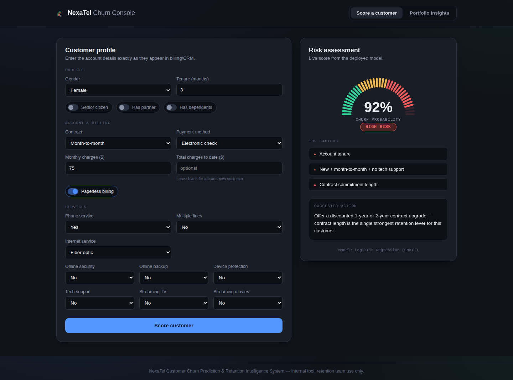
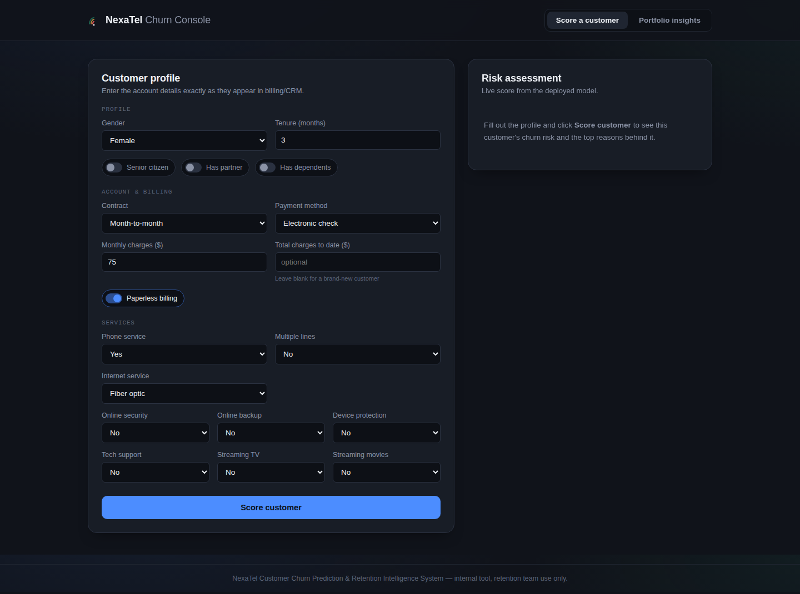
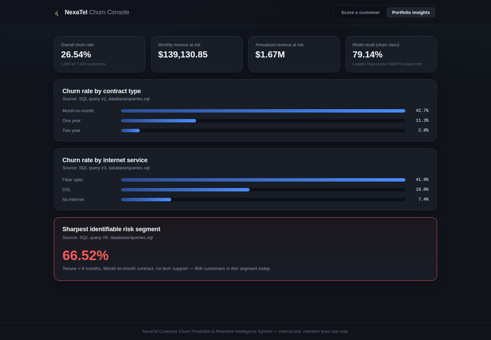

# NexaTel Churn Prediction & Retention Intelligence System

An end-to-end data science capstone: a messy business problem, a normalized SQL database, a full EDA → feature engineering → modeling → explainability pipeline, and a deployed full-stack web app a non-technical retention agent can actually use.

**Live demo:** `<add your Vercel URL here after deployment>`
**API docs:** `<add your Render URL here>/docs`



---

## The problem, in one paragraph

NexaTel Communications is losing 26.54% of its customers, worth **$139,130.85/month (~$1.67M/year)** in recurring revenue — and today the company only finds out after a customer has already cancelled. This project builds a model that scores every customer's churn risk *before* they leave, explains the top 3 reasons behind that score in plain language, and puts both in front of the retention team as a simple web tool — not a notebook only a data scientist can read.

Full write-up: [`docs/00_problem_statement.md`](docs/00_problem_statement.md)

## Key results (real numbers, not projections)

| | |
|---|---|
| Final model | Logistic Regression, trained on SMOTE-balanced data |
| Recall on churn class | **79.14%** (catches 4 out of 5 customers who actually churn) |
| F1-score | 62.32% |
| ROC-AUC | 83.68% |
| Beats naive baseline by | +79.14 points of recall (naive "predict no-churn" model = 0% recall) |
| Sharpest identifiable risk segment | Tenure < 6 months + month-to-month + no tech support → **66.52% churn rate** (908 customers) |

Full model comparison and the reasoning behind the final choice — including why the simpler model beat Random Forest and XGBoost on the metric that matters here — is in [`docs/model_selection_justification.md`](docs/model_selection_justification.md).

## What it looks like

| Score a customer | Portfolio insights |
|---|---|
|  |  |

The churn-probability gauge is deliberately styled after a telecom signal-strength meter rather than a generic progress ring — tying the one bold visual choice in the app back to the subject matter.

---

## Architecture

```
                     ┌─────────────────────┐
  Raw CSV  ───────▶  │  PostgreSQL (Supabase)│   4 normalized tables:
  (7,043 rows)       │  customers/accounts/  │   customers, accounts,
                     │  services/churn_status│   services, churn_status
                     └──────────┬───────────┘
                                │  SQL (15 business queries)
                                ▼
                     ┌─────────────────────┐
                     │  Jupyter notebooks    │  EDA → Feature Engineering
                     │  01 – 05              │  → Preprocessing → Modeling
                     │                       │  → SHAP Explainability
                     └──────────┬───────────┘
                                │  model.pkl, preprocessor.pkl
                                ▼
                     ┌─────────────────────┐        ┌──────────────────┐
                     │  FastAPI backend      │◀──────▶│  React frontend   │
                     │  (Render)             │  JSON  │  (Vercel)         │
                     │  /predict              │        │  Score + Insights │
                     │  /dashboard-stats      │        │  tabs             │
                     └─────────────────────┘        └──────────────────┘
```

**Design decision worth calling out:** `ml/feature_engineering.py` and `ml/explain.py` are the *single source of truth* for feature engineering and explanation logic. They're imported by the notebooks **and** duplicated into `backend/app/ml/` for the live API, specifically so training-time and serving-time logic can never silently drift apart (a very common way real churn models break in production). See [`backend/app/predict.py`](backend/app/predict.py) for how it's wired together.

## Tech stack

| Layer | Choice |
|---|---|
| Database | PostgreSQL (Supabase free tier) |
| Data / ML | pandas, scikit-learn, XGBoost, imbalanced-learn (SMOTE), SHAP |
| Backend | FastAPI |
| Frontend | React (Vite) |
| Backend hosting | Render |
| Frontend hosting | Vercel |

---

## Repository structure

```
nexatel-churn-prediction/
├── database/
│   ├── schema.sql              # 3NF PostgreSQL schema + v_customer_360 view
│   ├── load_data.py             # CSV -> normalized tables ETL script
│   ├── queries.sql              # 15 commented business SQL queries
│   └── query_results_raw.txt    # actual output of running queries.sql
├── notebooks/
│   ├── 01_eda.ipynb                    # pulls from the DB, not the CSV
│   ├── 02_feature_engineering.ipynb
│   ├── 03_preprocessing.ipynb
│   ├── 04_modeling.ipynb               # 8 model/strategy combos, tuning
│   └── 05_explainability.ipynb         # SHAP
├── ml/                           # shared feature-engineering + explain code
│   ├── feature_engineering.py    # imported by notebooks AND backend
│   └── explain.py
├── models/                       # model.pkl, preprocessor.pkl, comparison tables
├── backend/                      # FastAPI app (self-contained, deployable alone)
│   ├── app/
│   │   ├── main.py                # /predict, /dashboard-stats, /health
│   │   ├── predict.py
│   │   ├── schemas.py
│   │   ├── ml/                    # local copy of the shared ml/ package
│   │   └── model_artifacts/       # model.pkl + preprocessor.pkl copies
│   ├── requirements.txt
│   └── render.yaml
├── frontend/                     # React + Vite app
│   ├── src/
│   │   ├── App.jsx
│   │   ├── api.js
│   │   └── components/
│   │       ├── ScoreCustomerTab.jsx
│   │       ├── InsightsTab.jsx
│   │       └── SignalGauge.jsx    # the signature visual
│   └── vercel.json
├── docs/
│   ├── 00_problem_statement.md
│   ├── sql_findings_summary.md
│   ├── model_selection_justification.md
│   ├── case_study.md
│   ├── resume_bullets.md
│   └── deployment_guide.md        # <- start here to deploy this yourself
├── data/
│   ├── raw/                       # original CSV
│   └── processed/                 # engineered features, train/test splits
└── assets/screenshots/
```

---

## Running it locally

### 1. Database (PostgreSQL)

You need a PostgreSQL instance — either local Postgres or a free Supabase project (see [`docs/deployment_guide.md`](docs/deployment_guide.md) for exact Supabase setup steps).

```bash
psql "$DATABASE_URL" -f database/schema.sql
python database/load_data.py        # reads DATABASE_URL from .env
```

### 2. Notebooks (optional — artifacts are already committed)

```bash
pip install -r backend/requirements.txt jupyter matplotlib seaborn shap imbalanced-learn xgboost
jupyter nbconvert --to notebook --execute --inplace notebooks/*.ipynb
```

### 3. Backend

```bash
cd backend
python -m venv venv && source venv/bin/activate   # optional but recommended
pip install -r requirements.txt
cp .env.example .env
uvicorn app.main:app --reload --port 8000
# -> http://localhost:8000/docs for interactive API docs
```

### 4. Frontend

```bash
cd frontend
npm install
npm run dev
# -> http://localhost:5173  (Vite dev server proxies /api to localhost:8000 automatically)
```

Open `http://localhost:5173`, fill out the customer form, click **Score customer**.

---

## Deploying this yourself

I built and tested every layer of this project, but I can't create accounts, push to your GitHub, or click "Deploy" on Render/Vercel on your behalf. **[`docs/deployment_guide.md`](docs/deployment_guide.md)** is a copy-paste, step-by-step walkthrough for exactly that last mile, covering:

1. Creating your Supabase project and loading the data
2. Pushing this folder to a new GitHub repository
3. Deploying the backend to Render
4. Deploying the frontend to Vercel
5. Connecting the two and testing the live link end-to-end

## Further reading

- [Problem statement](docs/00_problem_statement.md) — the business framing this whole project is built to answer
- [SQL findings summary](docs/sql_findings_summary.md) — plain-language findings from the database layer
- [Model selection justification](docs/model_selection_justification.md) — full model comparison table + why Logistic Regression won
- [Case study](docs/case_study.md) — one-page portfolio/LinkedIn writeup
- [Resume bullets](docs/resume_bullets.md) — ready-to-use bullet points for this project
